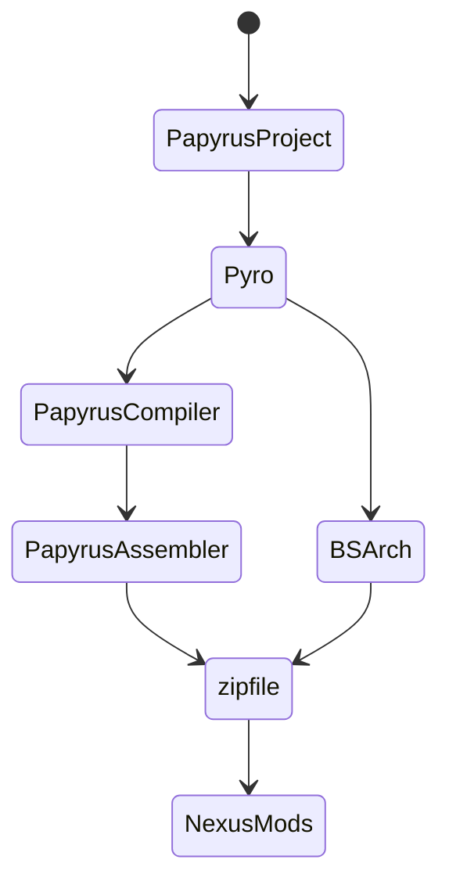
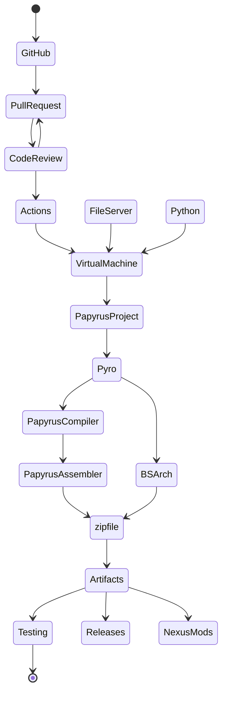
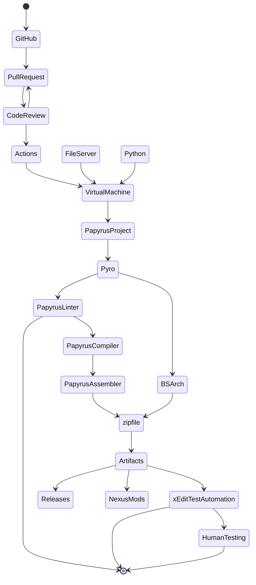

# Local Build

In the local build workflow, you have various ways of building projects. You can:

- drag-and-drop the PPJ onto the Pyro executable;
- pass the path to the PPJ to Pyro using the command line; or
- run Pyro directly from PyCharm or a pipenv.

## Requirements

ID | Requirement | Notes
:--- | :--- | :--- 
`Pyro` | Pyro | Latest binaries, or cloned repo
`PapyrusCompiler` | Installed Game | TESV, SSE, and FO4 all have a `Papyrus Compiler` folder that contains the necessary binaries. You will also need the `Data\Scripts\Source` folder and its contents, so you will need to install the Creation Kit for each game.
`PapyrusAssembler` | Installed Game | Same as above.
`NexusMods` | NexusMods Account | You need a NexusMods account to upload files.

## Workflow Diagram

# GitHub Actions

This workflow is entirely theoretical and has not been tested.

## Requirements

ID | Requirement | Notes
:--- | :--- | :--- 
`VirtualMachine` | Windows Server 2019 | `PapyrusCompiler.exe` is a .NET application and requires a window, so `wine` or `mono` on a Linux server would have trouble running this process.
`FileServer` | HTTPS or SFTP Server | The `Papyrus Compiler` and the `Data\Scripts\Source` folders and their contents would need to be hosted on a file server. They can be hosted in ZIP files and later extracted by the build script.  Ideally, Bethesda Softworks would create GitHub repositories for these files; otherwise, the file server should be secured so as to avoid publicly distributing Bethesda's assets.  In addition, to protect server credentials, the project's repo would need to be private.

## Workflow Diagram 

# Futuristic Workflow

## Requirements

ID | Requirement | Notes
:--- | :--- | :--- 
`PapyrusLinter` | Linting | A lexer/parser for Papyrus would allow Pyro to offer code analysis, syntax checking, code clone cleanup, and refactoring assistance. Alternatively, the Papyrus Compiler can be patched to output the AST, and Pyro can use that AST directly.
`xEditTestAutomation` | Plugin verification | An xEdit-based CLI would enable Pyro to verify that paths to BSA/BA2 assets are correct, verify that script properties are filled and used, and execute other user-defined verification tests.

## Workflow Diagram 

