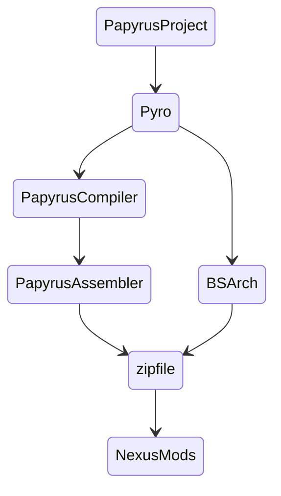
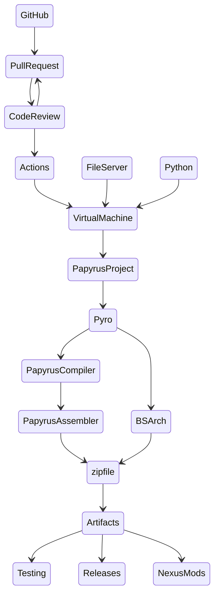

# Local Build

In the local build workflow, you drag-and-drop the PPJ onto the Pyro executable, pass the path to the PPJ to Pyro using the command line, or run Pyro directly from PyCharm. Simple!

## Requirements

ID | Requirement | Notes
:--- | :--- | :--- 
`Pyro` | Pyro | Latest binaries, or cloned repo
`PapyrusCompiler` | Installed Game | TESV, SSE, and FO4 all have a `Papyrus Compiler` folder that contains the necessary binaries. You will also need the `Data\Scripts\Source` folder and its contents, so you will need to install the Creation Kit for each game.
`PapyrusAssembler` | Installed Game | Same as above.
`NexusMods` | NexusMods Account | You need a NexusMods account to upload files.

## Workflow Diagram

# GitHub Actions

This workflow is entirely theoretical and has not been tested.

## Requirements

ID | Requirement | Notes
:--- | :--- | :--- 
`VirtualMachine` | Windows Server 2019 | `PapyrusCompiler.exe` is a .NET application and requires a window, so `wine` or `mono` on a Linux server would have trouble running this process.
`FileServer` | HTTPS or SFTP Server | The `Papyrus Compiler` and the `Data\Scripts\Source` folders and their contents would need to be hosted on a file server. They can be hosted in ZIP files and later extracted by the build script.  Ideally, Bethesda Softworks would create GitHub repositories for these files; otherwise, the file server should be secured so as to avoid publicly distributing Bethesda's assets.  In addition, to protect server credentials, the project's repo would need to be private.

## Workflow Diagram 

