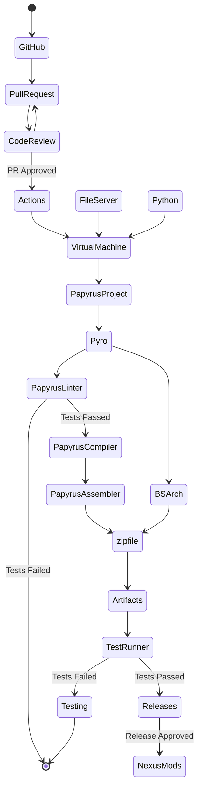

# Overview

This workflow is not possible given the available tools today.

# Requirements

ID | Requirement | Notes
:--- | :--- | :--- 
`PapyrusLinter` | Linter | A lexer/parser for Papyrus would allow Pyro to offer code analysis, syntax checking, code clone cleanup, and refactoring assistance. Alternatively, the Papyrus Compiler can be patched to output the AST, and Pyro can use that AST directly.
`TestRunner` | Plugin verification test runner | An xEdit-based CLI would enable Pyro to verify that paths to BSA/BA2 assets in records are correct, verify that script properties are filled and used, and execute other user-defined verification tests.

# Workflow Diagram 

