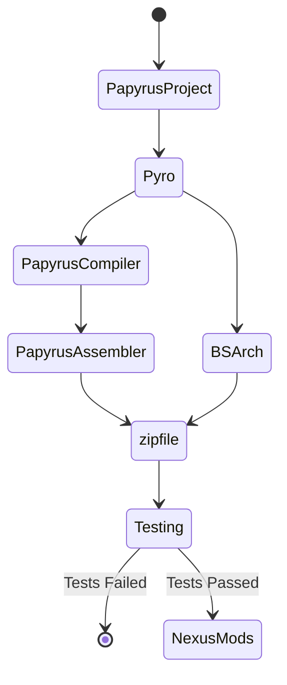

# Overview

In the local build workflow, you have various ways of building projects. You can:

- drag-and-drop the PPJ onto the Pyro executable;
- pass the path to the PPJ to Pyro using the command line; or
- run Pyro directly from PyCharm or a pipenv.

# Requirements

ID | Requirement | Notes
:--- | :--- | :--- 
`Pyro` | Pyro | Latest binaries, or cloned repo
`PapyrusCompiler` | Installed Game | TESV, SSE, and FO4 all have a `Papyrus Compiler` folder that contains the necessary binaries. You will also need the `Data\Scripts\Source` folder and its contents, so you will need to install the Creation Kit for each game.
`PapyrusAssembler` | Installed Game | Same as above.
`NexusMods` | NexusMods Account | You need a NexusMods account to upload files.

# Workflow Diagram

